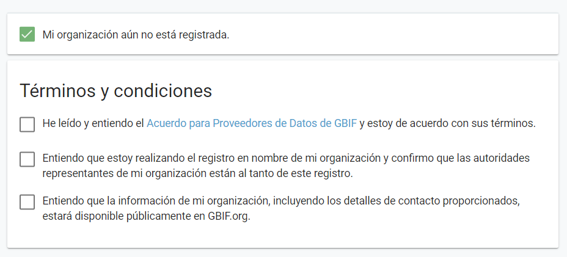

# Primeros Pasos

### Registro de la Organización

Previo a la publicación de datos se necesita registrar la institución en el portal de la Infraestructura Mundial de Información en Biodiversidad (Global Biodiversity Information Facility, GBIF) [llenando el formulario de registro en línea como publicador](https://www.gbif.org/es/become-a-publisher).&#x20;

Esta acción permite dar crédito y atribuir a la institución u organización sobre el o los conjuntos de datos, también denominado recursos, que comparten y además ayuda a los usuarios a identificar la procedencia de los datos compartidos a través de la red de GBIF.&#x20;

Previo a publicar conjuntos de datos en GBIF, la institución debe ser ratificada/verificada por parte del Nodo Nacional de GBIF, quien es encargado de coordinar las actividades de las organizaciones nacionales participantes. El procedimiento de verificación tiene como objetivo garantizar que:&#x20;

* Los datos publicados sean relevantes para el alcance y los objetivos de GBIF.&#x20;
* Los arreglos de alojamiento de datos son estables y persistentes.&#x20;
* La publicación y el uso de datos están respaldados por un fuerte compromiso nacional, regional y temático.&#x20;
* Los datos poseen la menor restricción de uso posible y están disponibles para compartir y reutilizar.&#x20;
* Los editores de datos pueden responder a los comentarios y mejorar la calidad de los datos.&#x20;

> _<mark style="color:green;">**El IPT solo publica datos de organizaciones, es decir, instituciones, redes y sociedades, en lugar de individuos**</mark>_

En primer momento se recomienda consultar si la Organización se encuentra registrada en GBIF para lo cual debe digitalizar el nombre de la misma en la primera línea.&#x20;

a. Si la Organización está registrada, solicite clave y usuario al Nodo Nacional de GBIF al correo victor.chocho@ambiente.gob.ec

b. Si la organización no se encuentra registrada. Marque en la casilla inferior izquierda \[“My organization is not already regisrered”]

Revise y acepte los términos y codiciones para continuar, marcando todas las casillas.

